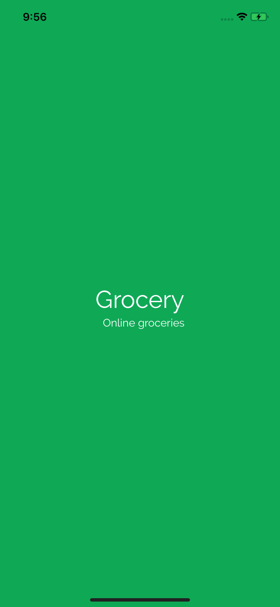
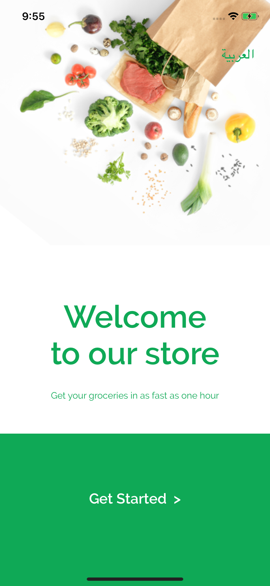
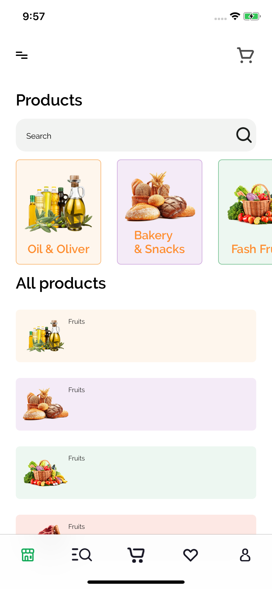
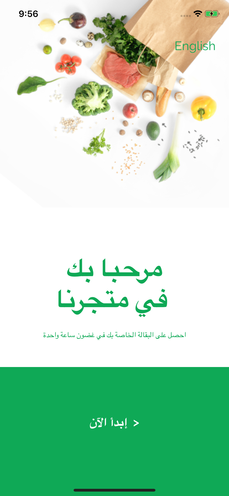

#  Nativescript Angular Template App  

> ### NativeScript codebase containing real examples (CRUD, auth, advanced patterns, etc).

This codebase was created to demonstrate a fully fledged application built with **NativeScript** including CRUD operations, authentication, routing, pagination, and more.

## Getting started

It is assumed that you have installed and configured NativeScript properly. If not, head to https://docs.nativescript.org/start/quick-setup and validate its correct functionality.

To start the emulator with this repository:

> `git clone https://github.com/atifmerghad/Nativescript-angular-template.git`  
> `cd Nativescript-angular-template`  
> `npm install` or `yarn add`  
> `tns run android` or `tns run ios`  
> `tns run ios --env.environment="dev" You can also define the environment (dev, prod or uat)`

## Generate the build (apk and api)

> `tns platfom [clean, add or remove] [ios or android]`  
> `tns build ios` or `tns run android`  
> `tns build ios --env.environment="dev" You can also define the environment (dev, prod or uat)`

## App Icon & Splash screen e\$ko

i
Replace App logo template logo.png with your logo under assets folder

Run the following command to generate App icons assets :

> `tns resources generate icons ~/assets/images/logo.png --background "#FFF"`

To generate a standard splash screen using bootsplash package.

> `tns resources generate splashes ~/assets/images/logo.png --background "#0FA956"`

More details [how to customize App Icon and Splash screen](https://docs.nativescript.org/tooling/docs-cli/project/configuration/resources/resources-generate-icons)

### Development

This project has been developed with [Visual Studio Code](https://code.visualstudio.com/) and the [NativeScript extension](https://www.nativescript.org/nativescript-for-visual-studio-code). It has been tested and live-synced with a local Iphone 11 Pro Max (ios 13) emulator for the most time.

## How it works

This app works as a NativeScript example and is based on [NativeScript 6](https://nativescript.org) Angular/TypeScript style.

Head over to the [NativeScript Docs](https://docs.nativescript.org/angular/start/introduction) to find out how to get started with NativeScript, Angular and Typescript.

### Concepts

This app tries to show the following NativeScript concepts:

- i18n
- Custom Component inclusion
- AutGuard & Interceptor
- Security ( Check Jailbreak, ...)
- Services
- Application Settings
- Custom ActionBar
- Lazy-loading
- Modal Dialogs
- Navigation
- Plugins (NativeScript and npm JavaScript)
- Sass (scss)
- TTF inclusion
- e2e testing

To show as many concepts as possible the structure is not necessarily consistent but may differ between views. This example app does not claim best-practice or anything similar but just one way of achieving a result.

### Architecture

The project follows the general NativeScript/Angular structure without any specifics. It uses lazy-loaded modules to encapsulate functionality further. It uses frame and router navigation to go back and forth between pages.

The project itself is mainly located in the `src/` folder. It follows this general architecture:

- `src/`
  - `app/`
    - `components/` contains the different views and according logic, split into a general, lazy-loaded module structure resembling the UIs
    - `utils/`
      - `helpers/` contains authGuard ans interceptors
      - `models/` contains shared entity classes used as models throughout the other files
      - `services/` contains shared services used to encapsulated global, view-independent logic, i.e. the backend calls
  - `assets/` contains the different media files ( Images, Icons, Gif, Cert)
  - `envirenments/` contains the different envirenment variables ( dev, uat, prod)
  - `fonts/` contains [FontAwesome](https://fontawesome.com/v4.7.0/) icons used in the app. See [nativescript-ngx-fonticon](https://market.nativescript.org/plugins/nativescript-ngx-fonticon) for more information
  - `i18n/` contains the translation files. See [nativescript-localize](https://market.nativescript.org/plugins/nativescript-localize) for more information

#### Screenshots

</img>
</img>
</img>
</img>

### Plugins

This example app uses a set of available NativeScript plugins to visualize the possible usage. Head over to the [NativeScript Market](https://market.nativescript.org/) for more information.

Used NativeScript plugins from https://market.nativescript.org:

- [nativescript-feedback](https://market.nativescript.org/plugins/nativescript-feedback) to show general, fancy messages
- [nativescript-floatingactionbutton](https://market.nativescript.org/plugins/nativescript-floatingactionbutton) to add new articles
- [nativescript-localize](https://market.nativescript.org/plugins/nativescript-localize) to localize the static text
- [nativescript-ngx-fonticon](https://market.nativescript.org/plugins/nativescript-ngx-fonticon) to include [FontAwesome](https://fontawesome.com/) icons in menus
- [nativescript-ui-listview](https://market.nativescript.org/plugins/nativescript-ui-listview) to present the articles
- [nativescript-ui-sidedrawer](https://market.nativescript.org/plugins/nativescript-ui-sidedrawer) to add a side-menu
- [nativescript-ui-dataform](https://market.nativescript.org/plugins/nativescript-ui-dataform) to create and edit articles
- [nativescript-ui-autocomplete](https://market.nativescript.org/plugins/nativescript-ui-autocomplete) for the editor tag fields
- [nativescript-social-share](https://market.nativescript.org/plugins/nativescript-social-share) for article sharing
- [nativescript-dev-appium](https://market.nativescript.org/plugins/nativescript-dev-appium) for e2e Appium tests

## Testing

This project has been manually tested against

- Emulator
  - Iphone 11 Pro Max iOS 13
  - Pixel 3 Android SDK 23
- Devices
  - Iphone 12 Pro Max iOS 14
  - Samsung S8 Android 8.0.0

### Automated tests

The project contains an example e2e test to illustrate an end-to-end test case.

## Contributing

...
